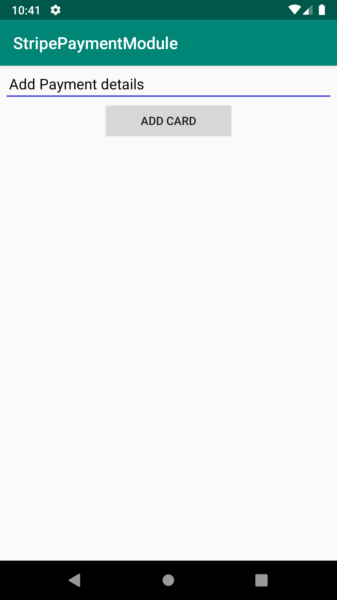
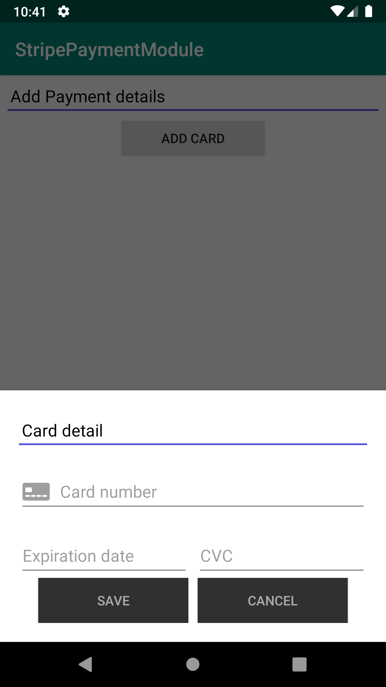

<h1>Introduction</h1>
INTUZ is presenting an interesting Custom Stripe-Payment Control to integrate inside your native Android-based application. 
Stripe-Payment is a simple component, which lets you easy payment integration. 
<br/><br/>
<h1>Features</h1>

- Easy & Fast Integrate.
- You can change button text, text color and background color. 
- Just you need to pass context and API(Publish) key.
- You can get sucess or failur callback.

<div style="float:left">


</div>


<br/><br/>
<h1>Getting Started</h1>

To use this component in your project you need to perform the below steps:

Download
--------
Add `StripeModule` as a module in your project.  

Usage
--------

### Start StripHelper
```Kotlin

     val stripe = StripeHelper.StripeHelperBuilder(this@MainActivity, "Your strip payment API KEY", this)
                .setLabel("Card detail")
                .setSaveButtonLabel("Done") // Default label Save
                .changeSaveBackGroundColor(ContextCompat.getColor(
                    this@MainActivity,R.color.colorPrimary )) // Default save button bg color background_material_dark
                .changeSaveTextColor(ContextCompat.getColor(
                    this@MainActivity,R.color.buttonText ))    // Default save text color #AAAAAA
                .setCancelButtonLabel("Dismiss") // Default label cancel
                .changeCancelBackGroundColor(ContextCompat.getColor(
                    this@MainActivity,R.color.colorPrimary )) // Default Cancel button bg color background_material_dark
                .changeCancelTextColor(ContextCompat.getColor(
                    this@MainActivity,R.color.buttonText ))    // Default Cancel text color #AAAAAA
                .buildNewStripeHelper()
            stripe.showCardDialog()
```

### Receive Callback Success/Failure
```Kotlin

// OnPayment Fail
    override fun onStripPaymentInFail(errorMessage: String) {
        Log.e("Error", errorMessage)
    }

// OnPayment Success
    override fun onStripPaymentInSuccess(token: Token) {
        Log.e("TOEKN", token.id)
    }
```

**Note:** Make sure you pass working Strip key.


<br/><br/>
**<h1>Bugs and Feedback</h1>**
For bugs, questions and discussions please use the Github Issues.


<br/><br/>
**<h1>License</h1>**
The MIT License (MIT)
<br/><br/>
Copyright (c) 2020 INTUZ
<br/><br/>
Permission is hereby granted, free of charge, to any person obtaining a copy of this software and associated documentation files (the "Software"), to deal in the Software without restriction, including without limitation the rights to use, copy, modify, merge, publish, distribute, sublicense, and/or sell copies of the Software, and to permit persons to whom the Software is furnished to do so, subject to the following conditions: 
<br/><br/>
THE SOFTWARE IS PROVIDED "AS IS", WITHOUT WARRANTY OF ANY KIND, EXPRESS OR IMPLIED, INCLUDING BUT NOT LIMITED TO THE WARRANTIES OF MERCHANTABILITY, FITNESS FOR A PARTICULAR PURPOSE AND NONINFRINGEMENT. IN NO EVENT SHALL THE AUTHORS OR COPYRIGHT HOLDERS BE LIABLE FOR ANY CLAIM, DAMAGES OR OTHER LIABILITY, WHETHER IN AN ACTION OF CONTRACT, TORT OR OTHERWISE, ARISING FROM, OUT OF OR IN CONNECTION WITH THE SOFTWARE OR THE USE OR OTHER DEALINGS IN THE SOFTWARE.

<br/>
<h1></h1>
<a href="https://www.intuz.com/" target="_blank"></a>


